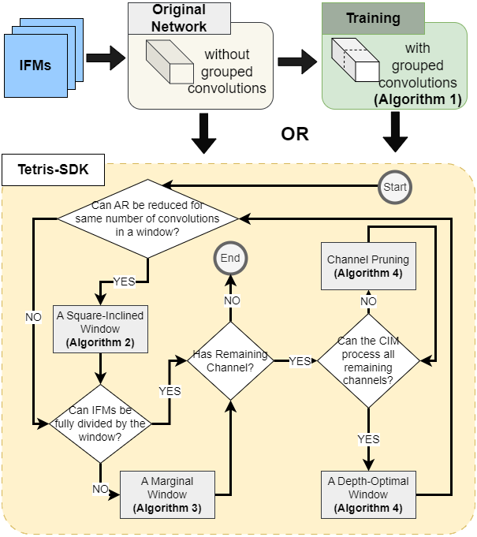

# Project Title

An example for TetrisG-SDK mapping algorithm, with NeuroSim.

## Description

### Title
TetrisG-SDK: Efficient Convolution Layer Mapping with Adaptive Windows for Fast In Memory Computing

### Demonstration of TetrisG-SDK
https://github.com/SybilD/Tetris-SDK/assets/44551139/e053e64f-5b52-4587-bc0e-f792581f3fae

### Abstract
Shifted-and-Duplicated-Kernel (SDK) mapping is an emerging technique for accelerating convolutional layers in Compute-In-Memory (CIM) architectures. While state-of-the-art SDK variants have achieved decent mapping efficiency, optimizations are still desired to enhance CIM utilization and minimize computing cycles. We propose TetrisG-SDK, a novel framework that exploits adaptive windows to boost mapping performance. These windows can accommodate more input channels, increase array utilization at marginal space, and adjust window shapes for latency. The methodology also leverages grouped convolutions to further decrease computing cycles, and ensure near-lossless network accuracy. Moreover, TetrisG-SDK is the first framework to integrate a validated, system-level CIM hardware simulator for accurate performance and energy estimation from an application perspective. Our experiments show that Tetris-SDK can remarkably accelerate convolution layer mapping. Compared to VW-SDK, it achieves a speed-up of 3.1× for ResNet50 on ImageNet classification and an improvement of overall latency and energy efficiency by 8.3× and 3.1×, respectively. This shows that TetrisG-SDK is a promising solution to map and accelerate Convolutional Neural Networks in CIM hardware.

### Flowchart


## Getting Started with TetrisG

### Dependencies

* Python 3.x

### Installing

* For TetrisG-SDK: Any IDE that can run Jupyter Notebook

### Executing TetrisG program

* Download the file and open it in IDE
* Run cell by cell or call the main function

```
python3 TetrisG_SDK.py
```

## Getting Started with NeuroSim

### Dependencies

* C++
* Python 3.9

### Installing

* For NeuroSim: Ubuntu 20.04 gcc: v9.4.0 glibc: v2.31 NVIDIA Driver Version: 525.60.13 CUDA Version: 12.0 (Refer to DNN+NeuroSim V1.4 https://github.com/neurosim/DNN_NeuroSim_V1.4/tree/main for more support)

### Executing NeuroSim Simulator

* Compile the NeuroSim C++ code
```
cd Inference_pytorch/NeuroSIM
make
```

* Run the Simulator
```
cd ..
python inference.py --dataset cifar10 --model DenseNet40 --mode WAGE --inference 1 --cellBit 1 --ADCprecision 6 --subArray 512 --parallelRead 512 | tee benchmark_tetris_group.log
```

* Refer to Layer 3 for the modified output, for other layers, modify the the Chip.cpp according to the instructions in the comments.

## Version History
* 2
    * Added NeuroSim
* 1
    * Added Tetris_with_grouped_convolutions
* 0.3
    * Added flowchart
* 0.2
    * Various bug fixes and optimizations
* 0.1
    * Initial Release
